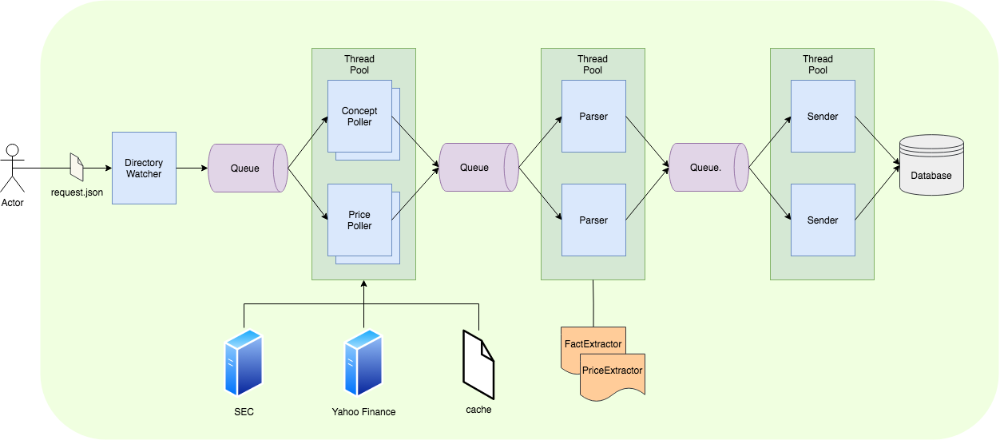

# Turbine
Turbine fetches company financial statement data filled with the SEC by leveraging the [EDGAR API](https://www.sec.gov/edgar/sec-api-documentation) as well as historical price data from [Yahoo Finance](https://finance.yahoo.com/).

## Table of Contents
- [Turbine](#turbine)
  - [Table of Contents](#table-of-contents)
  - [Features](#features)
  - [Architecture](#architecture)
  - [Setup IDE](#setup-ide)
  - [Configuration](#configuration)
  - [How to run](#how-to-run)
  - [Extractors](#extractors)
  - [Client](#client)

## Features
* **Configurabe**: Turbine is fully customizable and configurable. Name, poller/parser/sender implementation can be configured using a `.ini` file.
* **Logging**: Build in logging that can be configured using a `.ini` file. Any exceptions are automatically caught and properly logged.
* **Multithreading**: For maximum performance you can define how many pollers, parsers and senders Turbine should spawn. It autimatically optimizes based on available CPUs.
* **Transaction Handler**: You want to move successfully proccessed files (See [File Connector](#file-connector)) to an _archive_ directory and failed-to-proccess files to an _error_ folder? No problem. Just implement your custom Transaction Handler to get notified when a poll just finished or failed processing which you can then handle as you see fit.
* **Monitoring**: Turbine can be configured to listen on a specified port. Using the build in client a user can remotely connect to it and run basic queries or stop Turbine.
  
## Architecture
The main workers of the framework are the _Poller_, _Parser_ and the _Sender_.

**DirectoryWatcher**: The DirectoryWatcher watches the _input_ directory for any incoming `request.json` files. These files contain information about what data Turbine should fetch.

**Poller**: Poller threads connect to the source and poll for data. The source can be a database, file system, Web API, etc. The data is cached on disc as JSON or CSV file and then passed on to the Parser for further processing. Pollers will look if the requested data is cached before trying to fetch it from the original source. If you want to force the Pollers to re-fetch the data from the source you must erase the `cache` directory.

**Parser**: Parsers get the data files polled by the Pollers. They extract data and make it available for persistence. For that they dynamically load extractors from disc that handle the different data formats. The results are then passed on to the Senders.

**Sender**: Sender threads are responsible for persisting data into an SQLite database.



## Setup IDE
Here is an example on how to setup VSCode for use with this project. You can use any IDE you like.

```shell
$ git clone https://github.com/lucaslouca/turbine
$ cd turbine

# Create and activate virtual environment
$ python3 -m venv env
$ source env/bin/activate
```

Install the required libraries:
```shell
(env) $ pip install -r requirements.txt 
```

Finally open the project in VSCode:
```shell
(env) $ code .
```

Make sure VSCode also opens the project in the correct virtual environment.

Create a new launch configuration. Below is a run configuration to launch Turbine within VSCode:
```json
{
    "version": "0.2.0",
    "configurations": [
        {
            "name": "Turbine",
            "type": "python",
            "request": "launch",
            "program": "${workspaceRoot}/main.py",
            "console": "integratedTerminal",
            "args": [
                "-c",
                "config/connector.ini"
            ]
        }
    ]
}
```

## Configuration
Below is a sample configuration:

```ini
[CONNECTOR]
Name=Turbine
Host=127.0.0.1
Port=35813

[POLLER_concepts]
Class=implementation.concept_poller.ConceptPoller
Topic=concept
Args={}
MinThreads=2
MaxThreads=2

[POLLER_price]
Class=implementation.price_poller.PricePoller
Topic=price
Args={}
MinThreads=2
MaxThreads=2

[PARSER]
Class=implementation.parser.Parser
Args={}
MinThreads=2
MaxThreads=2

[SENDER]
Class=implementation.sender.Sender
Args={"db":"database.db"}
MinThreads=2
MaxThreads=2

# Optional
[TRANSACTION_HANDLER]
Class=implementation.file_transaction_handler.FileTransactionHandler
Args={"archive_dir":"out/archive", "error_dir":"out/error"}
```

## How to run
```shell
$ source env/bin/activate
(env) $ python main.py

CONNECTORS
-------------------------------------------------------------
[0] - Turbine
Connector to start> 0
...
```

To start the Turbine in the background just run it using `screen`:
```shell
(env) $ screen -S "turbine" -dm python main.py
```

You can see that the framework automatically picks up any configuration files found in the `config` directory and lists them as a run option.

## Extractors

You can easily create your custom extractors by subclassing the `AbstractExtractor` class and place the file into the `extractors` folder. Turbine will pick them up automatically on the next restart.

> **Important**: Your extractor class name must be the same as the file name of the Python file that contains it. For example, if your custom extractor is called `YourCustomExtractor`, then it must be placed in a Python file called `YourCustomExtractor.py` under the `extractors` directory.

Here is an example of an extractor that processes CSV files:

```Python
class PriceExtractor(AbstractExtractor):
    @overrides(AbstractExtractor)
    def supports_input(self, request: DataExtractionRequest):
        return request.file_extension and request.file_extension.upper() == ".CSV"

    ...

    @ overrides(AbstractExtractor)
    def extract(self, request: DataExtractionRequest):
        self.log(f"Proccessing '{request.file}'")
        result = []
        rows = self._read_rows_from_file(file=request.file)
        for row in rows:
            try:
                result.append(
                    Price(
                        ticker=Ticker(symbol=request.ticker),
                        date=dt.datetime.strptime(row['Date'], "%Y-%m-%d").date(),
                        open=float(row['Open']),
                        high=float(row['High']),
                        low=float(row['Low']),
                        close=float(row['Close']),
                        adj_close=float(row['Adj Close']),
                        volume=float(row['Volume'])
                    )
                )
            except Exception as e:
                self.log_exception(exception=e)

        return result
```
In the above example the method `supports_input(...)` simply tells the framework that this extractor can only be used for files that have the extension `.csv`.

The `extract(...)` method should return a list of _model_ objects that hold the extracted values.

Notice also how the extractor comes with logging capabilities as well using `self.log(...)`.

## Client
The framework comes also with a monitoring client. You can use this client to connect to your running connector and view its status or kill it.

```shell
(env) $ python client.py 127.0.0.1 -p 35813
=============================================================
Turbine
-------------------------------------------------------------
   Started: 2021-07-03 20:00:17.066630+02:00
    Poller: Poller (2)
    Parser: Parser (2)
    Sender: Sender (2)
-------------------------------------------------------------
Connector commands:
-------------------------------------------------------------
      stop: stop connector
     stats: show statistics
      head: show the first items in the queues
=============================================================
Client commands:
-------------------------------------------------------------
      quit: quit client
=============================================================

command>stats
         Polled: 5
         Parsed: 5
      Completed: 2
         Errors: 0

command>stop
(env) $ 
```
